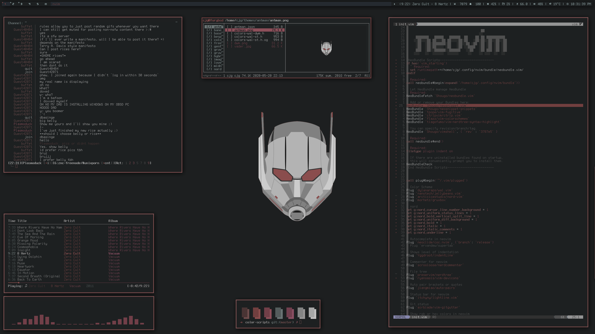

dwm - dynamic window manager
============================

is an extremely fast, small, and dynamic window manager for X written in C.

This is my personal patched version I use on FreeBSD.

Patches include: Fibonacii Layouts, The Column Layout, Cycle Layouts, Move Stack, Save Floats,  Resize Corners, Barpadding, Vanity Gaps, Alternative Tags, Urgent Borders, Scratchpad & Status All Monitors, Spawn Center plus others.

**Screenshots**

Requirements
------------
In order to build dwm you need the Xlib header files.

Installation
------------
Edit config.mk to match your local setup 

*Change X11INC = /usr/local/include and 
        X11LIB = /usr/local/lib to 
                 /usr/X11R6/include and 
                 /usr/X11R6/lib on Linux.*

(dwm is installed into
the /usr/local namespace by default).

Afterwards enter the following command to build and install dwm (if
necessary as root):

    make clean install

Running dwm
-----------
Add the following line to your .xinitrc to start dwm using startx:

    exec dwm

In order to connect dwm to a specific display, make sure that
the DISPLAY environment variable is set correctly, e.g.:

    DISPLAY=foo.bar:1 exec dwm

(This will start dwm on display :1 of the host foo.bar.)

In order to restart dwm without restarting x, add the following to
the end of your .xinitrc:

*while :; do
        ssh-agent dwm
done*

In order to display status info in the bar, you can do something
like this in your .xinitrc:

    while xsetroot -name "`date` `uptime | sed 's/.*,//'`"
    do
    	sleep 1
    done &
    exec dwm

Configuration
-------------
The configuration of dwm is done by creating a custom config.h
and (re)compiling the source code.
